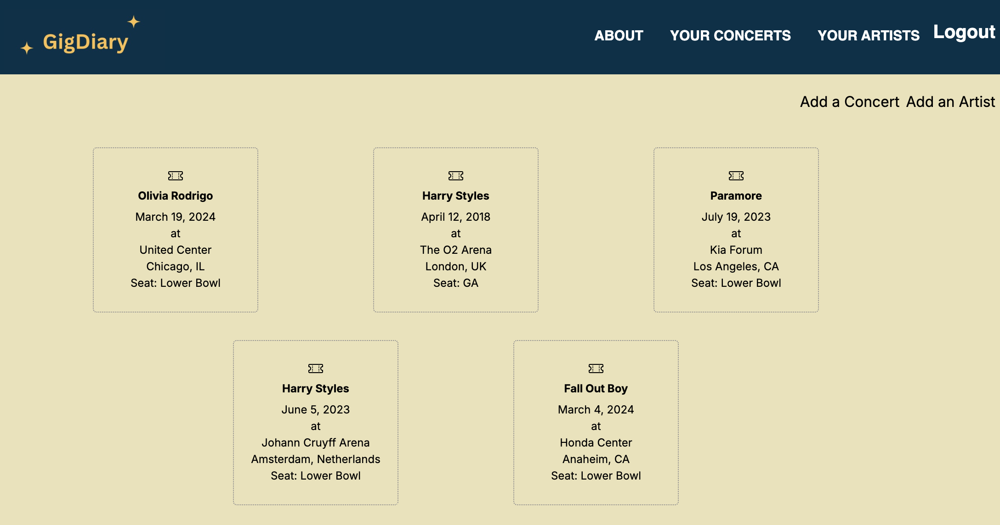

# Gig Diary

## Introduction
Gig Diary is a full stack concert logger app geared towards concertgoers who wish to log their experiences in a digital scrapbook. The idea was borne out of a conversation with a friend where we shared screenshots from our phone's notes app listing the Harry Styles concerts that we have attended. Gig Diary makes it easier for fans to easily see which concerts they have attended and review their experiences of those events.

## Live Demo 
Check out Gig Diary [here](https://gig-diary-91531bd45d38.herokuapp.com/).

## Planning Materials
For the planning of Gig Diary, I created an ERD chart, wireframes, a routing chart and user stories. Planning materials can be found here on [Trello](https://trello.com/b/cNU9sf5Z/concert-tracker-app)

## App Features
* Concert Logging - users enter the details of concerts that they have previously attended and included details such as the artist name, date, the venue, location. They can also leave a review so that in the future, they may revisit the entry to see what they did or didn't like about that experience
* Top artists - users can add a list of their favorite artists and note whether or not this artist is one of their top 5 favorites at the moment. If they are, they will be displayed on the user's concerts index page along with that artist's top five songs according to Spotify. This feature utilizes the Spotify API to dynamically update the tracks based on which artists are marked as a user's top five.
* CRUD functionality - users can create, read, update and delete both concert and artist entries on Gig Diary
* Image Upload - users can upload images of their concerts to look back on in the future 

## Technologies Used

* Python
* DTL
* CSS
* Django

## Resources Used
* Images: [Pixabay](https://pixabay.com/) 
* Font: [Google](https://fonts.google.com/)
* Box Shadow Effect: [FreeFrontend](https://codepen.io/carterfromsl/pen/LYqYRyN)
* CSS Menu Hover Effect: [FreeFrontend](https://codepen.io/t_afif/pen/bGQOaEb)
* Spotify API: [Spotify](https://developer.spotify.com/documentation/web-api)

## Next Steps

Stretch goals for GigDiary include:

* Ability to tally how many times a user has seen a particular artist based on their past entries
* Video uploads
* Ability to upload multiple photos in a concert entry
* Increased responsiveness 